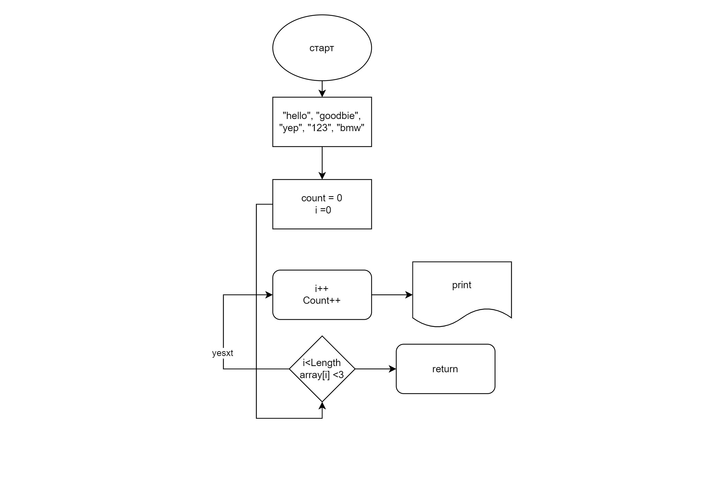

# final Project
## ***Описание***

*1* Решение простроено на основе метода котрый заранее получает(в код) слова или группы символов которые нужно обработать. 
Метод просроен на цикле for 
```
for (int i = 0; i < array1.Length; i++)
```
*2* Далее цикл проверяет длинну элемента образованного мачссива. Онад доалжна ыбть меньше 3.
*2* Схематически решение можно описать так: 

## **PS**
 К сожалению я не смог придумать ка реализовать ввод с клавиатуры для первого звдвния. Ведь как я узнал C# не поддерживает возможность динамического размера массива((. Однако в последннем коммите я смог придумать алгоритм ввода с клаиватуры. 002 полностью рабочая программа для пользовательского ввода.

